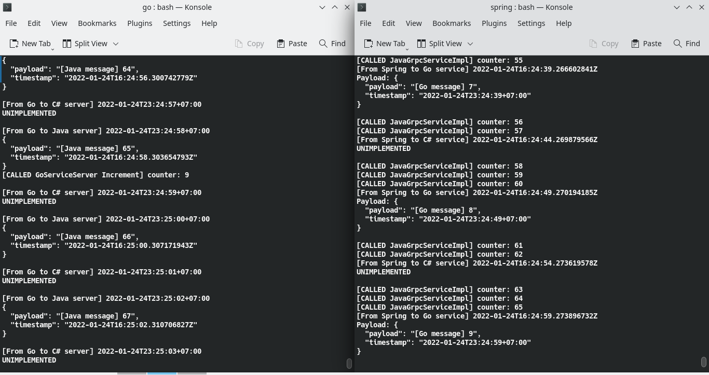

# What is this
Microservice gRPC demonstration w/incrementing state in multiple languages

1. Spring Kotlin
- Port: 50051
- Runtime: JDK 17
- Interval: 5s
 
```sh
./mvnw spring-boot:run
```

2. Go
- Port: 50052
- Runtime: Go 1.17
- Interval: 1s

```sh
go build && ./microservicegrpc
```

1. Dotnet (WIP)
- Port: 50053
- Runtime: .NET 6

```
dotnet run
```

